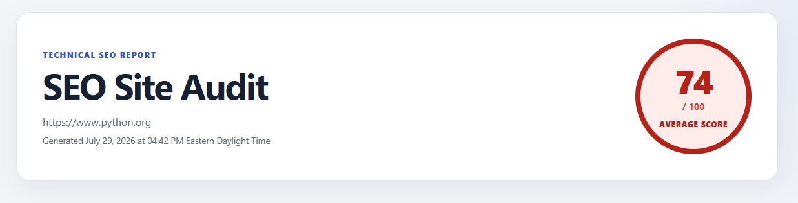
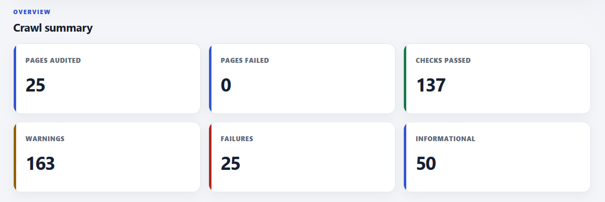
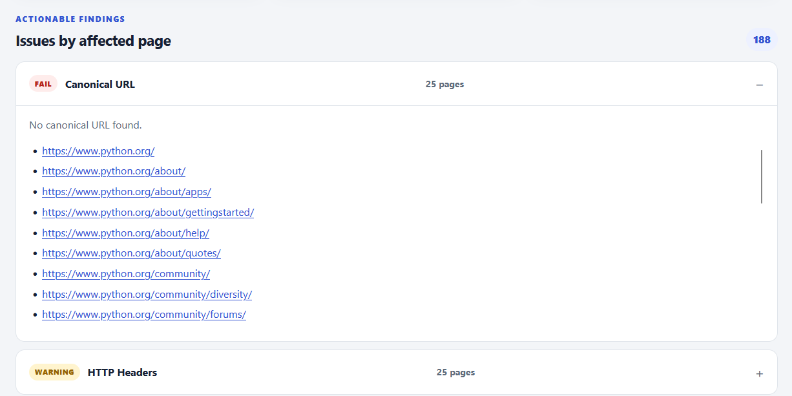

# SearchLens


SearchLens is a modular Python command-line application for auditing websites for common technical SEO issues. It supports single-page audits, multi-page crawls, weighted scoring, concurrent page analysis, interactive HTML reporting, CSV and JSON export, and internal-link graph generation.

## Dashboard



The interactive HTML dashboard includes:

- Overall crawl score
- Pages crawled and failed-page totals
- Warning and failure counts
- Highest- and lowest-scoring pages
- Expandable issue groups
- Searchable and sortable page table
- Failed-page summary






## Features

### Single-page audits

SearchLens checks an individual page for:

- Title tag
- Meta description
- Canonical URL
- H1 usage
- Heading hierarchy
- Robots meta directives
- Image attributes
- Open Graph metadata
- Twitter Cards
- Structured data
- Internal and external links
- HTTP response headers
- Security headers
- Response time
- Response size
- Compression
- Redirects
- HTTP status
- robots.txt
- XML sitemap availability

### Website crawl mode

- Breadth-first crawling
- Same-domain URL filtering
- Fragment removal and URL normalization
- Duplicate URL suppression
- Configurable page limits
- Concurrent page auditing
- Configurable worker count
- Request-failure recovery
- Internal-link relationship collection
- Weighted page scoring
- Crawl-wide summary reporting

### Reporting and export

SearchLens can generate:

- Console reports
- JSON exports
- CSV exports
- Interactive HTML dashboard
- Graphviz DOT site graph

---

## Example

Single page audit

```bash
python main.py https://example.com
```

### Website crawl

```bash
python main.py https://example.com --crawl
```

### Crawl with an HTML dashboard

```bash
python main.py https://example.com --crawl --html
```

### Generate all crawl exports

```bash
python main.py https://example.com --crawl --csv --html --graph
```

### Control concurrent auditing

```bash
python main.py https://example.com --crawl --workers 8
```

Use the built-in help command to see the options supported by the current version:

```bash
python main.py --help
```

## Project Structure

```text
SearchLens/
├── .github/
│   └── workflows/
│       └── tests.yml
├── auditor/
│   ├── checks/
│   │   ├── title.py
│   │   ├── headings.py
│   │   ├── links.py
│   │   ├── performance.py
│   │   └── ...
│   ├── application.py
│   ├── cli.py
│   ├── context.py
│   ├── crawler.py
│   ├── models.py
│   ├── runner.py
│   ├── scoring.py
│   ├── scoring_weights.py
│   ├── reporter.py
│   ├── site_reporter.py
│   ├── exporter.py
│   ├── crawl_csv_exporter.py
│   ├── crawl_html_exporter.py
│   └── graphviz_exporter.py
├── tests/
│   ├── test_application.py
│   ├── test_crawler.py
│   ├── test_headings.py
│   ├── test_models.py
│   └── test_scoring.py
├── images/
├── main.py
├── requirements.txt
└── README.md
```

## Architecture

SearchLens separates command-line parsing, application orchestration, crawling, auditing, scoring, reporting, and export logic.

```text
CLI
 │
 ▼
Application
 │
 ├── Single-page audit
 │
 └── Crawl discovery
          │
          ▼
   Concurrent page audits
          │
          ▼
       PageContext
          │
          ▼
        Runner
          │
          ▼
         Checks
          │
          ▼
      AuditResult
          │
          ├── Console reporting
          ├── JSON export
          ├── CSV export
          ├── HTML dashboard
          └── Graphviz site graph
```

Key design decisions include:

- `PageContext` provides checks with a shared response, parsed HTML document, and raw HTML.
- `AuditResult` gives every check a consistent result model.
- The runner controls which checks execute rather than allowing checks to depend on one another.
- The crawler performs breadth-first discovery and records internal-link relationships.
- Page auditing runs concurrently through `ThreadPoolExecutor`.
- Scoring weights are centralized so scoring policy stays separate from check implementation.
- Reporters and exporters are isolated from crawling and audit logic.

## Testing

Run the full test suite:

```bash
python -m pytest -v
```

Current local result:

```text
29 passed
```

The test suite covers:

- Application URL normalization
- Crawl URL normalization
- Internal and external URL classification
- Breadth-first page discovery
- Crawl page limits
- Duplicate and fragment handling
- Request-failure recovery
- Heading hierarchy analysis
- Result-model helpers and serialization
- Crawl statistics
- Weighted scoring behavior

## Continuous Integration

The repository includes a GitHub Actions workflow under:

```text
.github/workflows/tests.yml
```

The workflow installs project dependencies and runs the pytest suite against multiple supported Python versions whenever changes are pushed or a pull request is opened.

After the workflow passes on GitHub, replace the static test badge near the top of this README with the repository's live workflow badge.

## Technologies

- Python
- Beautiful Soup
- Requests
- pytest
- `concurrent.futures.ThreadPoolExecutor`
- HTML, CSS, and JavaScript
- Graphviz DOT
- GitHub Actions

## Design Goals

SearchLens emphasizes:

- Modular architecture
- Separation of responsibilities
- Type hints
- Dataclasses
- Testability
- Extensibility
- Predictable URL normalization
- Clear command-line usage
- Multiple output formats

## Why I Built This

I built SearchLens to deepen my understanding of Python application architecture while exploring technical SEO auditing.

Rather than focusing only on extracting SEO information, I wanted to practice building a maintainable application with clear boundaries between command-line handling, crawling, page analysis, scoring, reporting, and export logic.

The project evolved from a simple single-page auditor into a multi-page crawler with weighted scoring, concurrent auditing, automated tests, continuous integration, interactive HTML reporting, and internal-link visualization.

## Future Improvements

Potential future enhancements include:

- PageSpeed Insights integration
- Lighthouse integration
- Accessibility checks
- Richer robots.txt validation
- Additional structured-data validation
- JSON crawl export
- Asynchronous crawling
- Plugin-based check registration
- Configurable scoring profiles

## License

MIT License


## Why I Built This

I built this project to deepen my understanding of Python application architecture while exploring technical SEO auditing.

Rather than focusing only on extracting SEO information, I wanted to practice designing a maintainable application with clear separation of concerns, concurrent execution, automated testing, multiple export formats, and an interactive reporting interface.

The project evolved from a simple single-page auditor into a multi-page crawler with weighted scoring, interactive HTML reporting, and internal link visualization.